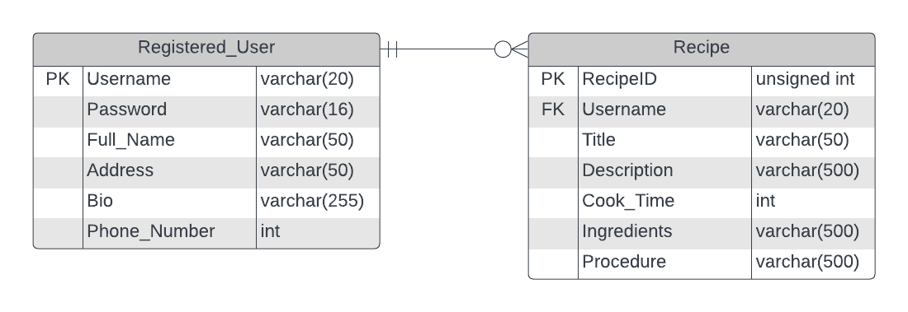

# Recipe Sharing API

API that provide services to save and share recipes. Using the API Platform feature, you can expose these endpoints to
external users
 

## Requirements

For development, you will only need Node.js and NPM, installed in your environment.

## Install

    $ git clone https://github.com/raihanromzi/recipe-sharing-api
    $ cd src/v1
    $ npm install

## Running the project

    $ nodemon app.js

## Project Info

### Architecture Diagram

### ERD

## API Endpoints

| URL                                       | POST              | GET                                            | PUT                              | DELETE        |
|-------------------------------------------|-------------------|------------------------------------------------|----------------------------------|---------------|
| /api/v1/users                             | Create an Account | Get list of All Users                          | -                                | -             |
| /api/v1/users/:username                   | -                 | Get User Information                           | Update User information          | -             |
| /api/v1/users/:username/recipes           | Add recipe        | Get recipe that have been created by this user | -                                | -             |
| /api/v1/users/:username/recipes/:recipeId | -                 | -                                              | Update Recipe From Specific User | Delete Recipe |
| /api/v1/users/:username/recipes/:recipeId | -                 | Get specific by Recipe ID                      | -                                | -             |
| /api/v1/recipes                           | -                 | Get list of all recipe                         | -                                | -             |
